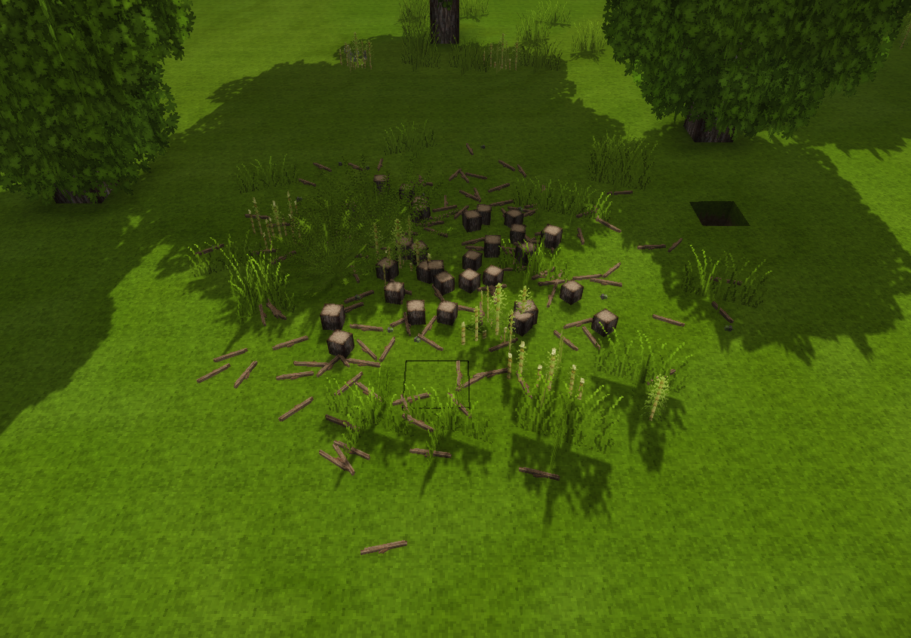

> ~~One Stick Mod to rule them all...~~
> 
> ~~And in darkness bind them!!!~~
_Wait a second sorry thats umm something else... don't mind that... anyhow... where was I? oh yeah I fixed a thing..._

# OneStick (Tree Felling Fix)

Currently just fixes what appears to be a bug in the vanilla axe code. 

When felling a tree the branchy leaves rarely ever drop sticks.

The game code seems to indicate that they should drop sticks around 80% of the time when felling the tree.

I started with this number as a static number but that did not feel right too many sticks and no ramp when using better axes.

- [OneStick (Tree Felling Fix)](#onestick-tree-felling-fix)
  - [Links n' Stuff](#links-n-stuff)
- [Version Support](#version-support)
    - [Older Version Support](#older-version-support)
  - [Screenshots](#screenshots)
  - [Config](#config)
    - [Options](#options)
      - [BranchDropRateStoneAxe](#branchdropratestoneaxe)
      - [BranchDropRateAxeMetal](#branchdroprateaxemetal)
      - [UseTierMode](#usetiermode)
      - [ToolTierZeroFellingBranchDropRate](#tooltierzerofellingbranchdroprate)
      - [ToolTierFiveFellingBranchDropRate](#tooltierfivefellingbranchdroprate)
      - [DebugMode](#debugmode)
- [Future Plans](#future-plans)
  - [Sticky sticky sticks](#sticky-sticky-sticks)

## Links n' Stuff
* [Discord](https://discord.gg/B548xTzfxX)
* [ModDB](https://mods.vintagestory.at/onestick)
* [Forum](https://www.vintagestory.at/forums/topic/9334-1165-onestick-treefellingfix/)

# Version Support
- [X] 1.16.5
- [ ] 1.17.0+

### Older Version Support
You you ask nicely and make an issue on github for it then I am likely to make a build for what ever version you want (within reason).

## Screenshots
_A picture is worth over 9000 words!!!_

## Config
### Options

#### BranchDropRateStoneAxe
The chance (0-1) that a tree will drop a branch when felled by a stone axe.

**Default:** 0.8

#### BranchDropRateAxeMetal
The chance (0-1) that a tree will drop a branch when felled by a metal axe.

**Default:** 0.8

#### UseTierMode
If true the mod will use the following two options to calculate the chance a tree will drop a branch. If false it will use the above two options.

**Default:** true

#### ToolTierZeroFellingBranchDropRate
The chance (0-1) that a tree will drop a branch when felled by a tool with a harvest level of 0.

**Default:** 0.1

#### ToolTierFiveFellingBranchDropRate
The chance (0-1) that a tree will drop a branch when felled by a tool with a harvest level of 5. This is the maximum harvest level.

**Default:** 0.8

#### DebugMode
If true the mod will log extra information to the console.

**Default:** false

# Future Plans

## Sticky sticky sticks

I plan to add several other features that will be likely off by default.

Some of my ideas are as follows:
- [ ] Dowls/Wooden Rods that can be used in place of sticks but also can be used by other mods for more advanced things that need more acurate long sticky things
- [ ] Allow crude wooden rods to be made by using a saw on the left or right of a plank in the crafting grid to split it down the center.
- [ ] Considering allowing an axe to do the above.
- [ ] Make some mechinery that allows the splitting of planks into logs.
- [ ] Allowing the mechinery to split planks into 3 Wooden Rods

I am totally open to any other ideas please suggest them to me.

You can suggest them to me on discord or anywhere else you find me.